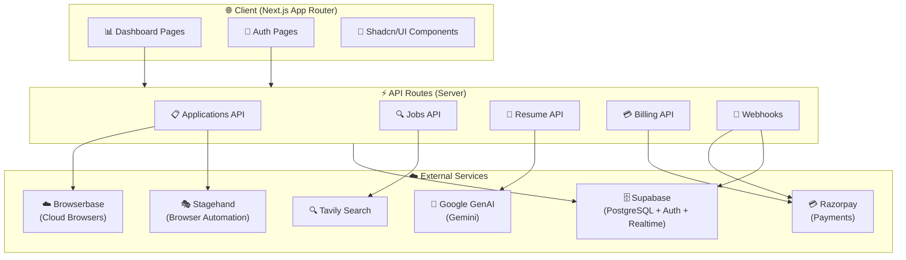

<div align="center">
  
  
  # JobBuddy AI
  
  **Smart AI Job Search Assistant & Resume Workspace — Automate applications, optimize resumes, and land interviews faster with AI-powered automation.**
  
  <p>
    <a href="#-quick-start"><strong>Quick Start</strong></a> •
    <a href="#-features"><strong>Features</strong></a> •
    <a href="#-architecture"><strong>Architecture</strong></a> •
    <a href="#-api-reference"><strong>API Reference</strong></a> •
    <a href="#-deployment"><strong>Deployment</strong></a> •
    <a href="#-contributing"><strong>Contributing</strong></a>
  </p>
  
  <br>
  
  
  
  
  
  
  
  
  
  <br>
  
  
  
</div>

---

<details open>
<summary><h2>📋 Table of Contents</h2></summary>

- [🎯 Overview](#-overview)
- [✨ Features](#-features)
- [🛠 Tech Stack](#-tech-stack)
- [🏗 Architecture](#-architecture)
- [🚀 Quick Start](#-quick-start)
- [⚙️ Configuration](#️-configuration)
- [📁 Project Structure](#-project-structure)
- [🔌 API Reference](#-api-reference)
- [🤖 AI Capabilities](#-ai-capabilities)
- [💳 Payment Integration](#-payment-integration)
- [🐳 Docker Deployment](#-docker-deployment)
- [🧪 Development](#-development)
- [📈 Future Roadmap](#-future-roadmap)
- [🤝 Contributing](#-contributing)
- [📄 License](#-license)

</details>

---

## 🎯 Overview

**JobBuddy AI** is a production-grade AI-powered job search platform that transforms the tedious job application process into an intelligent, automated workflow. Built for modern job seekers, it combines resume parsing, semantic job matching, browser-based auto-application, and subscription billing into a seamless Next.js 15 application.

### Why JobBuddy AI?

| Challenge | Traditional Approach | JobBuddy AI Solution |
|-----------|---------------------|---------------------|
| **Resume Optimization** | Manual tailoring per job | AI parses & structures resume; extracts skills, experience, keywords |
| **Job Discovery** | Manual search across 10+ boards | Tavily-powered semantic search across LinkedIn, Indeed, company pages |
| **Application Fatigue** | 30-60 min per application | Browserbase + Stagehand automate form filling & submission in seconds |
| **Tracking Chaos** | Spreadsheets, lost emails | Unified dashboard: applications, saved jobs, status timeline |
| **Cost Uncertainty** | Free tools with limits | Transparent subscription tiers with usage-based auto-apply credits |

### Target Users
- 🎓 **Recent Graduates** — High-volume applications, limited time
- 🔄 **Career Switchers** — Need resume optimization for new domains
- 💼 **Senior Professionals** — Targeted applications, tracking multiple pipelines
- 🏢 **Recruiters/Coaches** — Manage client applications in bulk

---

## ✨ Features

| Icon | Feature | Description | Status |
|------|---------|-------------|--------|
| 🤖 | **AI Resume Parser** | Extracts skills, experience, education, certifications using Google GenAI | ✅ Live |
| 🔍 | **Semantic Job Search** | Tavily-powered search across job boards with relevance scoring | ✅ Live |
| ⚡ | **Auto-Apply Engine** | Browserbase + Stagehand automate form detection, filling, submission | ✅ Live |
| 📊 | **Application Tracker** | Kanban-style pipeline: Applied → Screening → Interview → Offer | ✅ Live |
| 💾 | **Saved Jobs Library** | Bookmark, tag, annotate jobs with AI-generated match scores | ✅ Live |
| 👤 | **Profile Completeness** | Real-time scoring with actionable improvement suggestions | ✅ Live |
| 💳 | **Subscription Billing** | Razorpay integration: Free, Pro, Enterprise tiers with webhooks | ✅ Live |
| 🔐 | **Secure Auth** | Supabase Auth: Email/password, OAuth (Google, GitHub), magic links | ✅ Live |
| 📱 | **Responsive Dashboard** | Mobile-first UI with Shadcn/UI, sidebar navigation, dark mode | ✅ Live |
| 🔔 | **Real-time Updates** | Supabase Realtime for application status changes | 🚧 Planned |
| 📈 | **Analytics Dashboard** | Application funnel metrics, response rates, source attribution | 🚧 Planned |
| 🤝 | **Referral Network** | AI-matched referrals from LinkedIn connections | 🚧 Planned |

<details>
<summary><strong>🤖 AI Resume Parser — Deep Dive</strong></summary>

- **Multi-format support**: PDF, DOCX, TXT (via `lib/ai/parse-resume.ts`)
- **Structured extraction**: 
  - Personal info (name, email, phone, links)
  - Professional summary
  - Work experience (company, role, dates, achievements)
  - Education (degree, institution, honors)
  - Skills (technical, soft, certifications)
  - Projects & publications
- **Keyword optimization**: Identifies ATS keywords per target role
- **Gap analysis**: Highlights missing skills vs. job requirements
- **Output**: Structured JSON stored in Supabase for downstream matching
</details>

<details>
<summary><strong>⚡ Auto-Apply Engine — Deep Dive</strong></summary>

- **Browserbase infrastructure**: Cloud browsers with stealth mode
- **Stagehand orchestration**: 
  - `page.goto()` → job URL
  - `page.act()` → "fill application form with my profile data"
  - `page.extract()` → confirmation receipt, application ID
- **Smart form handling**:
  - Detects Workday, Greenhouse, Lever, custom ATS
  - Maps resume fields to form inputs (fuzzy matching)
  - Handles file uploads (resume, cover letter)
  - Manages multi-step wizards
- **Rate limiting**: Configurable delays, daily caps per tier
- **Error recovery**: Screenshots on failure, retry logic, manual fallback
</details>

<details>
<summary><strong>🔍 Semantic Job Search — Deep Dive</strong></summary>

- **Tavily API integration**: Real-time web search with AI summarization
- **Query construction**: 
  - Base: `"site:linkedin.com/jobs OR site:indeed.com OR site:company.com/careers"`
  - Filters: role, location, remote, experience, salary, visa
  - Recency: last 7/30 days
- **Relevance scoring**: 
  - Embedding similarity (resume skills ↔ job description)
  - Company tier, role match, location preference
- **Deduplication**: Cross-board duplicate detection via canonical URLs
- **Export**: Save to library, CSV export, Notion sync (planned)
</details>

---

## 🛠 Tech Stack

### Core Framework
| Technology | Version | Purpose |
|------------|---------|---------|
| **Next.js** | 15 (App Router) | Full-stack React framework, SSR, API routes |
| **React** | 19 | UI library |
| **TypeScript** | 5 | Type safety |
| **TailwindCSS** | 4 | Utility-first styling |
| **Shadcn/UI** | Latest | Accessible component library (Radix UI) |

### AI & Data
| Technology | Purpose |
|------------|---------|
| **@google/genai** | Google Gemini models for resume parsing, job matching |
| **@tavily/core** | Real-time web search API for job discovery |
| **@browserbasehq/sdk** | Cloud browser infrastructure |
| **@browserbasehq/stagehand** | Browser automation framework (Playwright wrapper) |

### Backend & Database
| Technology | Purpose |
|------------|---------|
| **Supabase** | PostgreSQL database, Auth, Realtime, Storage |
| **@supabase/ssr** | Server-side auth helpers for Next.js |
| **@supabase/supabase-js** | Client library |

### Payments & Billing
| Technology | Purpose |
|------------|---------|
| **Razorpay** | Payment gateway (India + International) |
| **Razorpay Webhooks** | Subscription lifecycle events |

### Developer Experience
| Technology | Purpose |
|------------|---------|
| **ESLint** | Linting (Next.js config) |
| **Prettier** | Code formatting |
| **TypeScript** | Strict mode enabled |

### Architecture Diagram



### Data Flow Diagram

```mermaid
sequenceDiagram
    participant User
    participant Dashboard
    participant API
    participant Supabase
    participant GenAI
    participant Tavily
    participant Browserbase
    participant Stagehand
   
